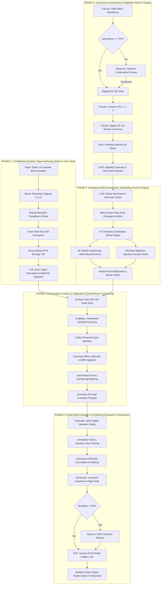
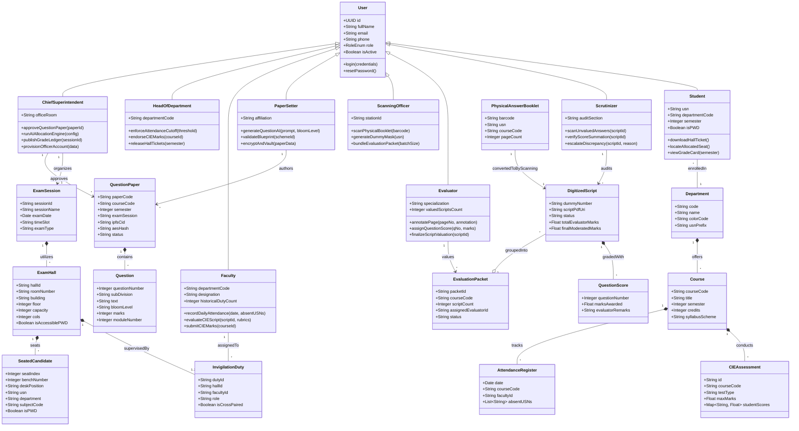
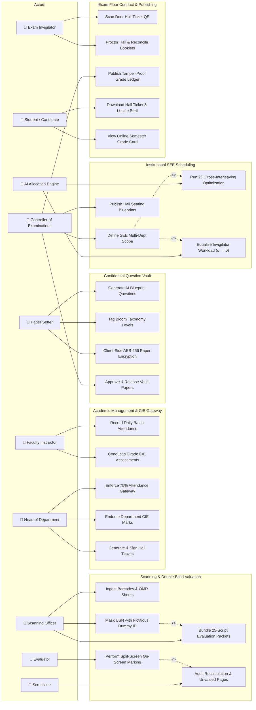

# NexAI Examination System - Architectural Diagrams Specification
### Complete Flowcharts, UML Class Models & Use Case Diagrams

This document contains formal UML and workflow specifications for the **NexAI Autonomous Examination Management System**.

---

## 1. End-to-End Institutional Examination Process Flowchart

---

## 2. AI Seating Allocation & Equal Workload Engine Flowchart

```mermaid
flowchart TD
  Start([Start: CoE Triggers AI Allocation]) --> Input[Input: Selected Departments, Semesters, Halls, Faculty Roster, 5% Buffer]
  
  Input --> GenQueues[Generate Enrolled Candidate Records]
  GenQueues --> SplitPWD[Filter Special Needs / PWD Candidates]
  
  SplitPWD --> SortHalls[Sort Exam Halls by Floor Level & Capacity]
  SortHalls --> PWDAlloc[Place PWD Candidates in Ground Floor Halls Floor 0]
  
  PWDAlloc --> InitLoop[Initialize 2D Hall Matrix: Rows x Cols with Aisles]
  
  InitLoop --> PopInterleave[Pull Candidate from Rotating Department Queues: Dept_i -> Dept_i+1]
  
  PopInterleave --> CheckLeft{Same Dept as Left Desk?}
  CheckLeft -- Yes --> SwapQueue[Swap with Candidate from Alternative Branch]
  SwapQueue --> CheckFront
  CheckLeft -- No --> CheckFront{Same Dept as Front Desk?}
  CheckFront -- Yes --> SwapQueue
  CheckFront -- No --> PlaceSeat[Place Candidate on Desk]
  
  PlaceSeat --> CapacityCheck{Hall Reached Target Capacity - 5% Buffer?}
  CapacityCheck -- No --> PopInterleave
  CapacityCheck -- Yes --> NextHall{More Halls to Allocate?}
  NextHall -- Yes --> InitLoop
  
  NextHall -- No --> FacultyStart[Initiate Invigilator Workload Balancer]
  FacultyStart --> CalcQuota[Compute Target Quota = Total Room Slots / Active Faculty]
  CalcQuota --> SortFaculty[Sort Faculty by Cumulative Historical Duties Ascending]
  
  SortFaculty --> AssignChief[Assign Chief Invigilator with Lowest Duty Count]
  AssignChief --> CheckRoomCap{Room Capacity > 35?}
  CheckRoomCap -- Yes --> AssignReliever[Assign Reliever Invigilator from Non-Conflicting Department]
  CheckRoomCap -- No --> CheckAntiBias
  
  AssignReliever --> CheckAntiBias{Invigilator Department == Majority Hall Department?}
  CheckAntiBias -- Yes --> CrossSwap[Swap with Invigilator from Complementary Branch]
  CheckAntiBias -- No --> UpdateDutyCount[Increment Current Cycle Duties]
  
  CrossSwap --> UpdateDutyCount
  UpdateDutyCount --> MoreRooms{More Rooms to Staff?}
  MoreRooms -- Yes --> SortFaculty
  MoreRooms -- No --> CalcTelemetry[Compute Telemetry: Interleaving Purity %, Fairness Variance, Utilization %]
  
  CalcTelemetry --> End([Output: Seating Blueprint, Invigilation Roster & Printable Notice])
```

---

## 3. Comprehensive UML Class Diagram

---

## 4. Comprehensive System Use Case Diagram

---

## 5. Summary Matrix: Diagram to Feature Mapping

| Diagram Type | Core Institutional Process Represented | Primary User Benefit |
| :--- | :--- | :--- |
| **Lifecycle Flowchart** | Phases 1–5: Attendance &rarr; CIE &rarr; Vault &rarr; SEE Allocation &rarr; Scanning &rarr; Valuation &rarr; Publishing | Provides administrators with complete end-to-end operational visibility. |
| **AI Allocation Engine Flowchart** | 2D Spatial Interleaving & Greedy Invigilator Workload Balancer | Explains exact mathematical anti-cheating & duty equality mechanisms. |
| **UML Class Diagram** | Complete Domain Entity Relationships, Multiplicities & Operations | Essential technical blueprint for backend developers and database architects. |
| **UML Use Case Diagram** | Actor-to-Task Interactions across all 8 Portals & Automated AI Agents | Clarifies segregation of responsibilities and permissions across roles. |
